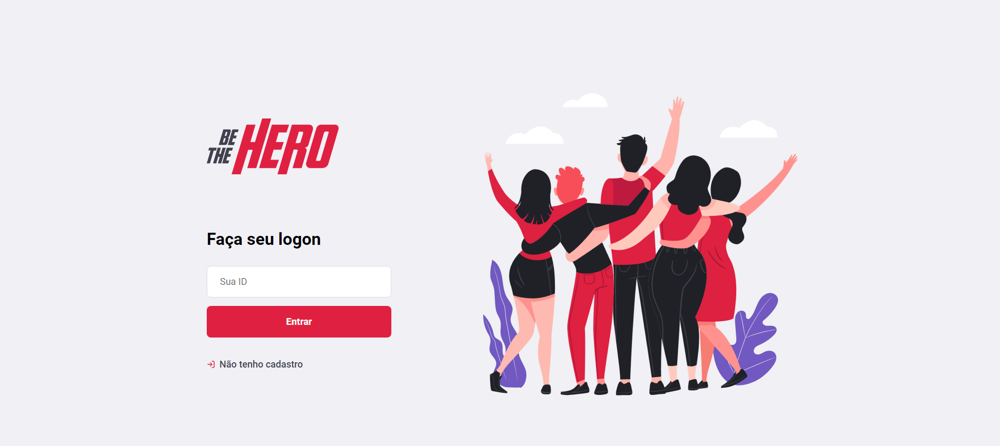

<!-- <h1 align="center">
    
</h1> -->

<h4 align="center">
  🚀 Semana OmniStack 11.0
</h4>

  

  
  
  

  

  

  <a href="#rocket-tecnologias">Tecnologias</a>&nbsp;&nbsp;&nbsp;|&nbsp;&nbsp;&nbsp;
  <a href="#-projeto">Projeto</a>&nbsp;&nbsp;&nbsp;|&nbsp;&nbsp;&nbsp;
  <a href="#-backend">Backend</a>&nbsp;&nbsp;&nbsp;|&nbsp;&nbsp;&nbsp;
  <a href="#-frontend">Frontend</a>&nbsp;&nbsp;&nbsp;|&nbsp;&nbsp;&nbsp;
  <a href="#-mobile">Mobile</a>&nbsp;&nbsp;&nbsp;|&nbsp;&nbsp;&nbsp;
  <a href="#-como-contribuir">Como contribuir</a>&nbsp;&nbsp;&nbsp;|&nbsp;&nbsp;&nbsp;
  <a href="#memo-licença">Licença</a>

 

<!-- 

  

 -->

---

## 🚀 Tecnologias

Esse projeto foi desenvolvido com as seguintes tecnologias:

- [Node.js](https://nodejs.org/en/)
- [React](https://reactjs.org)
- [React Native](https://facebook.github.io/react-native/)
- [Expo](https://expo.io/)
- [Jest](https://jestjs.io/)
- [Celebrate](https://github.com/arb/celebrate)

## 💻 Projeto
Projeto desenvolvido durante a <strong>Semana OmniStack</strong> que tem como objetivo conectar pessoas com vontade de ajudar que muitas vezes não tem tempo mas podem ajudar de uma forma monetária à ONGs.

## 🔨 Backend
<h1 align="center">

</h1>

## 🌐 Frontend
<h1 align="center">
    
</h1>

## 📱 Mobile
<h1 align="center">
    
</h1>

## 🤔 Como contribuir

- Faça um fork desse repositório;
- Cria uma branch com a sua feature: `git checkout -b minha-feature`;
- Faça commit das suas alterações: `git commit -m 'feat: Minha nova feature'`;
- Faça push para a sua branch: `git push origin minha-feature`.

Depois que o merge da sua pull request for feito, você pode deletar a sua branch.

## 🧾 Licença

Esse projeto está sob a licença MIT. Veja o arquivo [LICENSE](LICENSE.md) para mais detalhes.

---

Feito com 💗 by Raphael Barreto